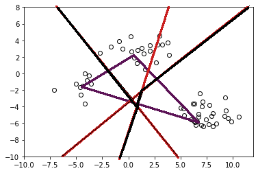

---
jupytext:
  formats: ipynb,md:myst
  text_representation:
    extension: .md
    format_name: myst
    format_version: 0.13
    jupytext_version: 1.11.5
kernelspec:
  display_name: Python 3 (ipykernel)
  language: python
  name: python3
---

# Midterm Exam #2 (20232) Written Session
**FIZ228 - Numerical Analysis**  
Dr. Emre S. Tasci, Hacettepe University

17/05/2024

+++

Consider the data plotted in the figure below. We want to classify these data points into three classes using k‑means clustering method. 

a) Mark the approximate expected positions of the means on the figure. Use the symbols "■", "▲" and "✖" to indicate the locations of the means, respectively.

+++

b) Indicate the domains of each domain on the figure. (Imagine being given a random point, after the means are fixed with respect to the previously existing data (which you did in the previous part) – to which mean would you assign this given point? Once you do the assignment, it means that, that position is <u>within the domain of that mean</u>. Now consider all the positions in the graph to define the domain of each mean and indicate these domains on the figure – that is what is being asked of you ;).

c) Derive a systematical algorithm to define the domains of each mean (writing a code is not necessary, also not desired, just define the procedures in steps so that a coder without any prior knowledge of the topic can implement it as a code).

+++


+++

d) One downside of this method is the fact that the resulting classification depends on the initial positions of the means. Suppose that for a different set (in which the classification might not be so obvious compared to the one above), you have run your code 20 times, coming up with 20 different associations, with the means’ final positions for each run also stored somewhere. How would you decide on the best classification?

+++

Bonus: The data plotted have been generated using three 2D Gaussians. A Gaussian is defined through this equation:

$$G(x;\mu,\sigma) = \frac{1}{\sqrt{2\pi\sigma^2}}\exp\left[-\frac{\left(x-\mu\right)^2}{\sqrt{2\sigma^2}}\right]$$

Describe how you’d generate such data using the Gaussian function. _(Try to justify parameters using numerical values with regard to the plotted data in the figure above.)_

+++

## Answers

a) A rough sketch showing the means on the figure was sufficient. It should be similar to the -exact- one below:


+++

b) Once again, showing a rough domain sketch was sufficient. By considering a couple of points (especially those that were almost at an equal length to the two or three means would be beneficial to draw the domains). It should be similar to the -exact- one below:


+++

c) This problem has multiple alternative solutions, the one described below is the one most commonly used by us (i.e., the physicists ;)

1. Join each mean to the others by a straight line. 
2. Draw a perpendicular line from the midpoint of these lines. This perpendicular line will separate the domain between the two (since the perpendicular line is at the middle, the side towards a mean will include points that is closer to that mean wrt the other one).
3. Follow the lines to resolve the map for all of the means by considering two means at a time. (In physics, this is known as the Wigner-Seitz cells and if applied in reciprocal space, takes the special name of "Brillouin Zone".)




+++

d) Not surprisingly, this question also has alternative solutions, alas not a definitive one (otherwise, we would be using it). One would be to take the one that's yielding the least sum of the squares of the distances of the points with respect to their associated mean, although this might prove problematic under specific conditions. Yet another solution could be to group the means obtained in each run that lie close to each other and taking their mean positions (like k-mean clustering the k-means 8).

```{code-cell} ipython3

```
