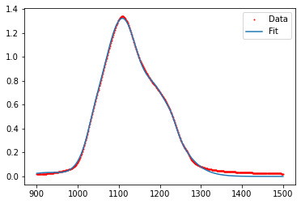
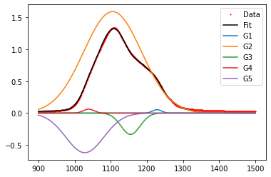
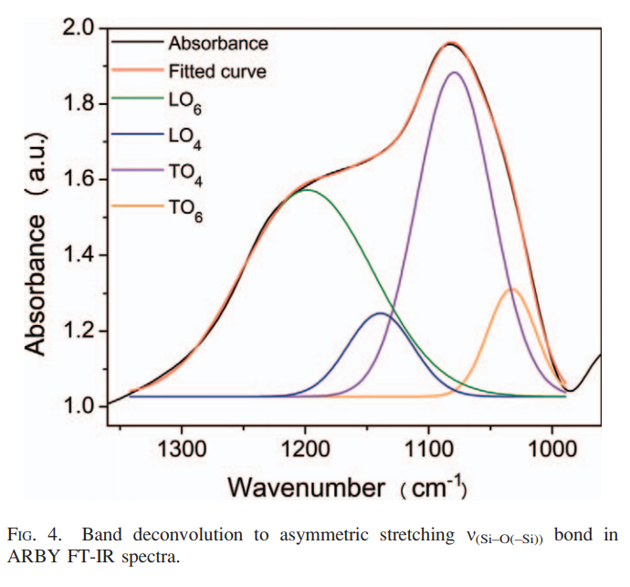

---
jupytext:
  formats: ipynb,md:myst
  text_representation:
    extension: .md
    format_name: myst
    format_version: 0.13
    jupytext_version: 1.11.5
kernelspec:
  display_name: Python 3 (ipykernel)
  language: python
  name: python3
---

# Exercise Set #3
**FIZ228 - Numerical Analysis**  
Dr. Emre S. Tasci, Hacettepe University

+++

Fit the {download}`Silica FTIR data<../data/05_Silica_FTIR.csv>` [Silica FTIR data] for the wavenumber range [900,1500] cm<sup>-1</sup>:

1. Using 3 Gaussians
2. Using 4 Gaussians
3. Using 5 Gaussians
4. Using 3 Lorentzians
5. Using 2 Gaussians & 2 Lorentzians

Calculate the coefficient of determination ($r^2$) for each fit.

+++

<hr>

**Information:**

A Gaussian characterized by ($A,\mu,\sigma$) is formulized as:

$$G(x;A,\mu,\sigma) = A\exp{\left[-\frac{(x-\mu)^2}{2\sigma^2}\right]}$$

whereas, a Lorentzian characterized by ($A,x_0,\gamma$) is formulized as:

$$ L(x;A,x_0,\gamma)=A\left[ { \gamma \over (x - x_0)^2 + \gamma^2  } \right]$$

+++

**Hints:**

* Once you solve one of the items, it will be pretty straightforward to apply the same routing to the rest.
* If at first you don't get any result or error from the `curve_fit()` or any other fit function you are using, it is most likely due to a bad starting point. Trial & error is a good approach but taking a hint from [Cappeletti et al.'s graph](https://doi.org/10.1366/12-06748) is the best one! ;) [See below]
* It's always a good idea to separately plot all the components to see if the components make sense (e.g., absorbance can never take negative values!)

+++

As an example for the last one, check the following fit of 5 Gaussians, with _r<sup>2</sup>_ = 0.998:



Even though it seems very good, here are its components, separately drawn:



which doesn't make any sense as G3 & G5 Gaussians indicate a negative absorption!

+++

## Cappeletti et al.'s graph



+++

# Reference & Acknowledgement
* I'm indebted to Prof. Sevgi Bayarı for generously supplying the FTIR data.
* L.B. Cappeletti et al., ["Determination of the Network Structure of Sensor Materials Prepared by Three Different Sol-Gel Routes Using Fourier Transform Infrared Spectroscopy (FT-IR)", Applied Spectroscopy 67(4) 441-447 (2012) (DOI: 10.1366/12-06748)](https://doi.org/10.1366/12-06748)

```{code-cell} ipython3

```
