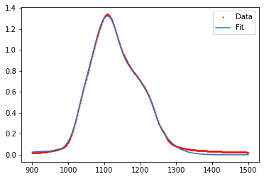
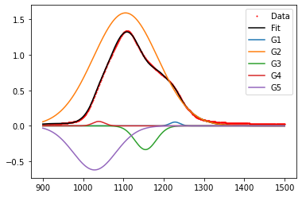

---
jupyter:
  jupytext:
    formats: ipynb,md
    text_representation:
      extension: .md
      format_name: markdown
      format_version: '1.3'
      jupytext_version: 1.11.5
  kernelspec:
    display_name: Python 3 (ipykernel)
    language: python
    name: python3
---

# Take-Home Exam #3
**FIZ228 - Numerical Analysis**  
Dr. Emre S. Tasci, Hacettepe University

_It is strictly forbidden to contact anybody outside your group or seeking the direct answer on the internet. Every member of the group is responsible for every one of the questions._


Fit the [Silica FTIR data](https://hadi.hacettepe.edu.tr/mod/resource/view.php?id=1184881) for the wavenumber range [900,1500] cm<sup>-1</sup>:

1. Using 3 Gaussians
2. Using 4 Gaussians
3. Using 5 Gaussians
4. Using 3 Lorentzians
5. Using 2 Gaussians & 2 Lorentzians

Calculate the coefficient of determination ($r^2$) for each fit.


<hr>

**Information:**

A Gaussian characterized by ($A,\mu,\sigma$) is formulized as:

$$G(x;A,\mu,\sigma) = A\exp{\left[-\frac{(x-\mu)^2}{2\sigma^2}\right]}$$

whereas, a Lorentzian characterized by ($A,x_0,\gamma$) is formulized as:

$$ L(x;A,x_0,\gamma)=A\left[ { \gamma \over (x - x_0)^2 + \gamma^2  } \right]$$


**Hints:**

* Once you solve one of the items, it will be pretty straightforward to apply the same routing to the rest.
* If at first you don't get any result or error from the `curve_fit()` or any other fit function you are using, it is most likely due to a bad starting point. Trial & error is a good approach but taking a hint from [Cappeletti et al.'s graph](https://hadi.hacettepe.edu.tr/course/view.php?id=150905#section-7) is the best one! ;)
* It's always a good idea to separately plot all the components to see if the components make sense (e.g., absorbance can never take negative values!)


As an example for the last one, check the following fit of 5 Gaussians, with _r<sup>2</sup>_ = 0.998:



Even though it seems very good, here are its components, separately drawn:



which doesn't make any sense as G3 & G5 Gaussians indicate a negative absorption!

```python

```
