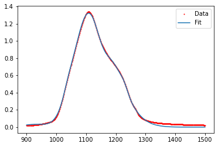
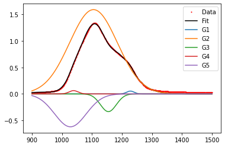

---
jupyter:
  jupytext:
    formats: ipynb,md
    text_representation:
      extension: .md
      format_name: markdown
      format_version: '1.3'
      jupytext_version: 1.11.5
  kernelspec:
    display_name: Python 3 (ipykernel)
    language: python
    name: python3
---

# Take-Home Exam #3
**FIZ228 - Numerical Analysis**  
Dr. Emre S. Tasci, Hacettepe University

_It is strictly forbidden to contact anybody outside your group or seeking the direct answer on the internet. Every member of the group is responsible for every one of the questions._


Fit the [Silica FTIR data](https://hadi.hacettepe.edu.tr/mod/resource/view.php?id=1184881) for the wavenumber range [900,1500] cm<sup>-1</sup>:

1. Using 3 Gaussians
2. Using 4 Gaussians
3. Using 5 Gaussians
4. Using 3 Lorentzians
5. Using 2 Gaussians & 2 Lorentzians

Calculate the coefficient of determination ($r^2$) for each fit.


<hr>

**Information:**

A Gaussian characterized by ($A,\mu,\sigma$) is formulized as:

$$G(x;A,\mu,\sigma) = A\exp{\left[-\frac{(x-\mu)^2}{2\sigma^2}\right]}$$

whereas, a Lorentzian characterized by ($A,x_0,\gamma$) is formulized as:

$$ L(x;A,x_0,\gamma)=A\left[ { \gamma \over (x - x_0)^2 + \gamma^2  } \right]$$


**Hints:**

* Once you solve one of the items, it will be pretty straightforward to apply the same routing to the rest.
* If at first you don't get any result or error from the `curve_fit()` or any other fit function you are using, it is most likely due to a bad starting point. Trial & error is a good approach but taking a hint from [Cappeletti et al.'s graph](https://hadi.hacettepe.edu.tr/course/view.php?id=150905#section-7) is the best one! ;)
* It's always a good idea to separately plot all the components to see if the components make sense (e.g., absorbance can never take negative values!)


As an example for the last one, check the following fit of 5 Gaussians, with _r<sup>2</sup>_ = 0.998:



Even though it seems very good, here are its components, separately drawn:



which doesn't make any sense as G3 & G5 Gaussians indicate a negative absorption!


# Solution

```python
import numpy as np
import pandas as pd
from scipy import optimize
import matplotlib.pyplot as plt
```

# Data

```python
data = pd.read_csv("../data/05_Silica_FTIR.csv",header=None)
data.columns = ["WaveNumber","Absorbance"]
data
```

```python
filterr = (data['WaveNumber']>=900) & (data['WaveNumber']<=1500)
data2 = data[filterr].copy()
data2 = data2.reset_index(drop=True)
data2
```

```python
plt.plot(data2.WaveNumber,data2.Absorbance,"b-")
plt.show()
```

# Functions

```python
def G(x,A,mu,sigma):
    return A*np.exp(-(x-mu)**2/(2*sigma**2))

def L(x,A,x0,gamma):
    return A*gamma/((x-x0)**2+gamma**2)
```

Let's write a handy function that returns the summation of multiple Gaussians:

```python
def G_n(x,As,mus,sigmas):
    n = len(As)
    res = 0
    for i in range(n):
        res += G(x,As[i],mus[i],sigmas[i])
    return res
```

```python
x = np.linspace(900,1500,601)
plt.plot(x,G_n(x,[3,4],[1100,1300],[50,50]))
plt.show()
```

and another that returns the summation of multiple Lorentzians:


```python
def L_n(x,As,x0s,gammas):
    n = len(As)
    res = 0
    for i in range(n):
        res += L(x,As[i],x0s[i],gammas[i])
    return res
```

```python
x = np.linspace(900,1500,601)
plt.plot(x,L_n(x,[3,4],[1100,1300],[50,50]))
plt.show()
```

# 1. 3 Gaussians

The following function is actually an auxillary (_helping_) function that bridges the way between the `optimize_curve()` and the `G_n()` functions. These kinds of intermediary functions are called as 'wrapper functions'.

```python
def G3(x,A1,A2,A3,mu1,mu2,mu3,s1,s2,s3):
    return G_n(x,[A1,A2,A3],[mu1,mu2,mu3],[s1,s2,s3])
```

Now we can try to fit the data into the `G3()` form. For the starting values, we can check the data, or even better since we have Cappeletti et al. data in its decomposed form, we can refer to that graph: 

```python
opt,_ = optimize.curve_fit(G3,data2.WaveNumber,data2.Absorbance,\
                   (1.3,1.9,1.5,1030,1090,1200,50,50,50))
opt
```

The returned array contains the fitted: 3 Amplitudes, 3 $\mu$s and 3 $\sigma$s, so let's collect them:

```python
As = opt[:3]
mus = opt[3:6]
sigmas = opt[-3:]
As,mus,sigmas
```

Now that we have grouped them into `As`, `mus` and `sigmas`, we can plot them using `G_n()`:

```python
plt.plot(data2.WaveNumber,data2.Absorbance,"r.",markersize=2)
plt.plot(x,G_n(x,As,mus,sigmas))
plt.legend(["Data","Fit"])
plt.show()
```

While we are at it, let's plot the 3 Gaussians individually:

```python
plt.plot(data2.WaveNumber,data2.Absorbance,"r.",markersize=2)
plt.plot(x,G_n(x,As,mus,sigmas),"k-")
for i in range(3):
    plt.plot(x,G(x,As[i],mus[i],sigmas[i]),"-")
plt.legend(["Data","Fit","G1","G2","G3"])
plt.show()
```

## Coefficient of determination (<i>r<sup>2</sup></i>)

```python
# Sum of the squares of the data residuals
S_t = np.sum((data2.Absorbance - data2.Absorbance.mean())**2)
S_t
```

```python
# Sum of the squares of the estimate residuals
S_r = np.sum((data2.Absorbance - G_n(data2.WaveNumber,As,mus,sigmas))**2)
S_r
```

```python
r2 = 1 - (S_r/S_t)
r2
```

# 2. 4 Gaussians

This will be more or less same procedure as above.

```python
def G4(x,A1,A2,A3,A4,mu1,mu2,mu3,mu4,s1,s2,s3,s4):
    return G_n(x,[A1,A2,A3,A4],[mu1,mu2,mu3,mu4],[s1,s2,s3,s4])
```

The challenging part for this one is to find adequate starting points. One can proceed to use the same values for all, and values picked from statistics, but there's no guarantees -- trial and error within reasonable ranges will be the key...

```python
opt,_ = optimize.curve_fit(G4,data2.WaveNumber,data2.Absorbance,\
                   (1.6,1.3,1.9,1.4,1200,1150,1080,1030,10,10,10,10))
opt
```

```python
k = 4
As = opt[:k]
mus = opt[k:2*k]
sigmas = opt[-k:]
As,mus,sigmas
```

```python
plt.plot(data2.WaveNumber,data2.Absorbance,"r.",markersize=2)
plt.plot(x,G_n(x,As,mus,sigmas))
plt.legend(["Data","Fit"])
plt.show()
```

```python
plt.plot(data2.WaveNumber,data2.Absorbance,"r.",markersize=2)
plt.plot(x,G_n(x,As,mus,sigmas),"k-")
for i in range(4):
    plt.plot(x,G(x,As[i],mus[i],sigmas[i]),"-")
plt.legend(["Data","Fit","G1","G2","G3","G4"])
plt.show()
```

```python
S_t = np.sum((data2.Absorbance - data2.Absorbance.mean())**2)
S_r = np.sum((data2.Absorbance - G_n(data2.WaveNumber,As,mus,sigmas))**2)
r2 = 1 - (S_r/S_t)
r2
```

# 3. 5 Gaussians

```python
def G5(x,A1,A2,A3,A4,A5,mu1,mu2,mu3,mu4,mu5,s1,s2,s3,s4,s5):
    return G_n(x,[A1,A2,A3,A4,A5],[mu1,mu2,mu3,mu4,mu5],[s1,s2,s3,s4,s5])
```

```python
opt,_ = optimize.curve_fit(G5,data2.WaveNumber,data2.Absorbance,\
                   (1.6,1.2,1.9,1.3,0,1200,1150,1080,1030,1000,10,10,10,10,10))
opt
```

```python
# Bad choice of starting points,
# resulting in negative curves:
#opt,_ = optimize.curve_fit(G5,data2.WaveNumber,data2.Absorbance,\
#        (1.6,1.2,1.9,2,1,1200,1150,1180,1030,1000,10,20,10,10,10))
#opt
```

```python
k = 5
As = opt[:k]
mus = opt[k:2*k]
sigmas = opt[-k:]
As,mus,sigmas
```

```python
plt.plot(data2.WaveNumber,data2.Absorbance,"r.",markersize=2)
plt.plot(x,G_n(x,As,mus,sigmas))
plt.legend(["Data","Fit"])
plt.show()
```

```python
plt.plot(data2.WaveNumber,data2.Absorbance,"r.",markersize=2)
plt.plot(x,G_n(x,As,mus,sigmas),"k-")
for i in range(5):
    plt.plot(x,G(x,As[i],mus[i],sigmas[i]),"-")
plt.legend(["Data","Fit","G1","G2","G3","G4","G5"])
plt.show()
```

```python
S_t = np.sum((data2.Absorbance - data2.Absorbance.mean())**2)
S_r = np.sum((data2.Absorbance - G_n(data2.WaveNumber,As,mus,sigmas))**2)
r2 = 1 - (S_r/S_t)
r2
```

# 4. 3 Lorentzians

```python
def L3(x,A1,A2,A3,x01,x02,x03,gamma1,gamma2,gamma3):
    return L_n(x,[A1,A2,A3],[x01,x02,x03],[gamma1,gamma2,gamma3])
```

```python
opt,_ = optimize.curve_fit(L3,data2.WaveNumber,data2.Absorbance,\
                   (1.3,1.9,1.5,1030,1090,1200,10,10,10))
opt
```

```python
As = opt[:3]
x0s = opt[3:6]
gammas = opt[-3:]
As,x0s,gammas
```

```python
plt.plot(data2.WaveNumber,data2.Absorbance,"r.",markersize=2)
plt.plot(x,L_n(x,As,x0s,gammas))
plt.legend(["Data","Fit"])
plt.show()
```

```python
plt.plot(data2.WaveNumber,data2.Absorbance,"r.",markersize=2)
plt.plot(x,L_n(x,As,x0s,gammas),"k-")
for i in range(3):
    plt.plot(x,L(x,As[i],x0s[i],gammas[i]),"-")
plt.legend(["Data","Fit","L1","L2","L3"])
plt.show()
```

```python
S_t = np.sum((data2.Absorbance - data2.Absorbance.mean())**2)
S_r = np.sum((data2.Absorbance - L_n(data2.WaveNumber,As,x0s,gammas))**2)
r2 = 1 - (S_r/S_t)
r2
```

# 5. 2 Gaussians & 2 Lorentzians

```python
def G2L2(x,A1,A2,A3,A4,mu1,mu2,x03,x04,sigma1,sigma2,gamma3,gamma4):
    return G_n(x,[A1,A2],[mu1,mu2],[sigma1,sigma2]) +\
           L_n(x,[A3,A4],[x03,x04],[gamma3,gamma4])
```

```python
opt,_ = optimize.curve_fit(G2L2,data2.WaveNumber,data2.Absorbance,\
                  (1,1,1,1,1200,1080,1150,1040,3,3,3,3))
opt
```

```python
k = 4
As = opt[:k]
mus = opt[k:2*k]
sigmas = opt[-k:]
As,mus,sigmas
```

```python
plt.plot(data2.WaveNumber,data2.Absorbance,"r.",markersize=2)
#plt.plot(x,G2L2(x,*As,*mus,*sigmas))
plt.plot(x,G2L2(x,As[0],As[1],As[2],As[3],\
            mus[0],mus[1],mus[2],mus[3],\
            sigmas[0],sigmas[1],sigmas[2],sigmas[3]),"k-")
plt.legend(["Data","Fit"])
plt.show()
```

```python
plt.plot(data2.WaveNumber,data2.Absorbance,"r.",markersize=2)
plt.plot(x,G2L2(x,*As,*mus,*sigmas))
for i in range(2):
    plt.plot(x,G(x,As[i],mus[i],sigmas[i]),"-")
for i in range(2,4):
    plt.plot(x,L(x,As[i],mus[i],sigmas[i]),"-")

plt.legend(["Data","Fit","G1","G2","L1","L2"])
plt.show()
```

```python
S_t = np.sum((data2.Absorbance - data2.Absorbance.mean())**2)
S_r = np.sum((data2.Absorbance - G2L2(data2.WaveNumber,*As,*mus,*sigmas))**2)
r2 = 1 - (S_r/S_t)
r2
```

```python

```
