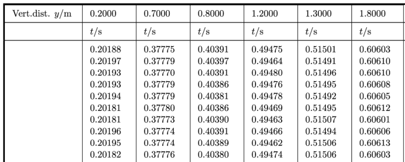

---
jupytext:
  formats: ipynb,md:myst
  text_representation:
    extension: .md
    format_name: myst
    format_version: 0.13
    jupytext_version: 1.11.5
kernelspec:
  display_name: Python 3 (ipykernel)
  language: python
  name: python3
---

# Least Squares Method & Error Estimations
**FIZ228 - Numerical Analysis**  
Dr. Emre S. Tasci, Hacettepe University

+++

# Data & Import
The free-fall data we will be using is taken from: D. Horvat & R. Jecmenica, "The Free Fall Experiment" _Resonance_ **21** 259-275 (2016) [\[https://doi.org/10.1007/s12045-016-0321-9\]](https://doi.org/10.1007/s12045-016-0321-9).



Here's the content of our data file:

+++

```
Vert.dist. y/m,0.2,0.7,0.8,1.2,1.3,1.8
,t/s,t/s,t/s,t/s,t/s,t/s
1,0.20188,0.37775,0.40391,0.49475,0.51501,0.60603
2,0.20197,0.37779,0.40397,0.49464,0.51491,0.60610
3,0.20193,0.37770,0.40391,0.49480,0.51496,0.60610
4,0.20193,0.37779,0.40386,0.49476,0.51495,0.60608
5,0.20194,0.37779,0.40381,0.49478,0.51492,0.60605
6,0.20181,0.37780,0.40386,0.49469,0.51495,0.60612
7,0.20181,0.37773,0.40390,0.49463,0.51507,0.60601
8,0.20196,0.37774,0.40391,0.49466,0.51494,0.60606
9,0.20195,0.37774,0.40389,0.49462,0.51506,0.60613
10,0.20182,0.37776,0.40380,0.49474,0.51506,0.60603
<t>/s,0.20190,0.37776,0.40388,0.49471,0.51498,0.60607
```

{download}`03_FreeFallData.csv<data/03_FreeFallData.csv>`

```{code-cell} ipython3
import pandas as pd
data1 = pd.read_csv("data/03_FreeFallData.csv")
data1.columns
data1
```

We don't need the first row and first column, so let's remove them via [pandas.DataFrame.drop](https://pandas.pydata.org/pandas-docs/stable/reference/api/pandas.DataFrame.drop.html):

```{code-cell} ipython3
data1.drop(0, inplace=True)
data1.drop(11, inplace=True)
data1.drop(['Vert.dist. y/m'],axis=1, inplace=True)
data1
```

Be careful that the data have been imported as string (due to the first row initially being formed of strings 8P ):

```{code-cell} ipython3
data1.loc[2,"0.7"]
```

```{code-cell} ipython3
type(data1.loc[2,"0.7"])
```

```{code-cell} ipython3
data1.dtypes
```

So, let's set them all to float:

```{code-cell} ipython3
data1 = data1.astype('float')
data1.dtypes
```

```{code-cell} ipython3
data1
```

While we're at it, let's do a couple of make-overs:

```{code-cell} ipython3
data1.reset_index(inplace=True,drop=True)
data1
```

## Plotting

```{code-cell} ipython3
import seaborn as sns
sns.set_theme() # To make things appear "more beautiful" 8)
```

```{code-cell} ipython3
data2 = data1.copy()
data2
```

```{code-cell} ipython3
plt1 = sns.relplot(data=data2,kind="line",marker="o")
k =plt1.set(xticks=data2.index)
```

```{code-cell} ipython3
data2.mean()
```

```{code-cell} ipython3
data_stats = pd.DataFrame(data2.mean())
data_stats.rename(columns={0:'dmean'}, inplace=True )
data_stats['dvar'] = data2.var()
data_stats['dstd'] = data2.std()
data_stats
```

```{code-cell} ipython3
data_stats.dstd # Unbiased
```

$$\sigma = \sqrt{\frac{\sum_{i}{\left(x_i - \bar{x}\right)^2}}{N}}\;\text{(Population)}$$ 

or 

$$\sigma = \sqrt{\frac{\sum_{i}{\left(x_i - \bar{x}\right)^2}}{N-1}}\;\text{(Sample)}$$

```{code-cell} ipython3
import numpy as np
N = data2.shape[0]
for coll in list(data2.columns):
    s_dev = 0
    s_mean = data2.loc[:,coll].mean()
    #print(s_mean)
    for x_i in data2.loc[:,coll]:
        # print (x_i)
        s_dev += (x_i - s_mean)**2
    s_dev = np.sqrt(s_dev/(N))
    print("{:s}: {:.6f}".format(coll,s_dev))
```

```{code-cell} ipython3
data2.std(ddof=0) # Biased
```

Average over all the sample deviations should be equal to the deviation of the population!

For more information on this _Bessel's Correction_, check: http://mathcenter.oxford.emory.edu/site/math117/besselCorrection/

+++

# Types of Errors
## True error ($E_t$)
$$E_t = \text{true value} - \text{approximation}$$
## Absolute error ($\left|E_t\right|$)
$$\left|E_t\right| = \left|\text{true value} - \text{approximation}\right|$$
## True fractional relative error
$$\frac{\text{true value} - \text{approximation}}{\text{true value}}$$
## True percent relative error ($\varepsilon_t$)
$$\varepsilon_t = \frac{\text{true value} - \text{approximation}}{\text{true value}}\,100\%$$

But what if we don't know the true value?..

## Approximate percent relative error ($\varepsilon_a$)
$$\varepsilon_a = \frac{\text{present approximation} - \text{previous approximation}}{\text{present approximation}}\,100\%$$

Computations are repeated until $\left|\varepsilon_a\right| < \left|\varepsilon_s\right|$ ($\varepsilon_s$ is the satisfactory precision criterion).

The result is correct to at least $n$ significant figures given that:

$$\varepsilon_s=\left(0.5\times10^{2-n}\right)\,\%$$

+++

### Example:
$$e^x = 1+x+\frac{x^2}{2}+\frac{x^3}{3!}+\dots+\frac{x^n}{n!}+\dots$$

To estimate $e^{0.5}$ so that the absolute value of the approximate error estimate falls below an error criterion conforming to 3 significant figures, how many terms do you need to include?

+++

**Solution:**

$\varepsilon_s=(0.5\times 10^{2-3})\,\%$

```{code-cell} ipython3
eps_s = 0.5*10**(2-3)
print("{:.2f}%".format(eps_s))
```

```{code-cell} ipython3
eps_s = 0.5*10**(2-3)

x = 0.5
eps_a = 1000
e_prev = 0
no_of_terms = 0
print("{:>3} {:^13}\t{:^10}".format("#","e","E_a"))
while(eps_a > eps_s):
    e_calculated = e_prev + x**no_of_terms/np.math.factorial(no_of_terms)
    eps_a = np.abs(((e_calculated - e_prev)/e_calculated))*100
    print("{:3d}:{:10.6f}\t{:16.5f}".format(no_of_terms+1,e_calculated,eps_a))
    e_prev = e_calculated
    no_of_terms += 1
```

```{code-cell} ipython3
eps_s = 0.5*10**(2-3)
e_sqrt_real = np.sqrt(np.e)

x = 0.5
eps_a = 1000
e_sqrt_prev = 0
no_of_terms = 0
print("{:>3} {:^13}{:^20}{:^12}".format("#","e_calc","E_a","E_t"))
while(eps_a > eps_s):
    e_sqrt_calculated = e_sqrt_prev + x**no_of_terms/np.math.factorial(no_of_terms)
    eps_a = np.abs(((e_sqrt_calculated - e_sqrt_prev)/e_sqrt_calculated))*100
    eps_t = np.abs((e_sqrt_real - e_sqrt_calculated)/e_sqrt_real)*100
    print("{:3d}:{:10.6f}{:16.5f}{:16.5f}".format(no_of_terms+1,e_sqrt_calculated,eps_a,eps_t))
    e_sqrt_prev = e_sqrt_calculated
    no_of_terms += 1
```

# How good is a mean?
Once again, consider our free fall data:

```{code-cell} ipython3
data2
```

```{code-cell} ipython3
data_stats
```

# [scipy.optimize.minimize](https://docs.scipy.org/doc/scipy/reference/generated/scipy.optimize.minimize.html#scipy.optimize.minimize) to the rescue!

```{code-cell} ipython3
data2['0.2'].shape
```

```{code-cell} ipython3
from scipy.optimize import minimize

def fun_err(m,x):
    err = 0
    for x_i in x:
        err += (x_i - m)**2
    err = np.sqrt(err/x.shape[0])
    return err
```

```{code-cell} ipython3
fun_err(data2['0.2'].mean(),data2['0.2'])
```

```{code-cell} ipython3
fun_err(data2['0.2'].mean()+1,data2['0.2'])
```

```{code-cell} ipython3
minimize(fun_err,data2['0.2'].mean(),args=(data2['0.2']),tol=1E-3)
```

```{code-cell} ipython3
data2['0.2'].mean()
```

```{code-cell} ipython3
list(data2.columns)
```

```{code-cell} ipython3
data_stats.loc['0.2','dmean']
```

```{code-cell} ipython3
print("{:^5}: {:^8} ({:^8})".format("col","min","mean"))
for col in list(data2.columns):
    res_min = minimize(fun_err,1,args=(data2[col]))
    print("{:^5}: {:8.6f} ({:8.6f})".format(col,float(res_min.x),data_stats.loc[col,'dmean']))
```

## Couldn't the cost function be better?

```{code-cell} ipython3
def fun_err2(m,x):
    err = 0
    for x_i in x:
        err += (x_i - m)**2
    #err = np.sqrt(err/x.shape[0])
    return err
```

```{code-cell} ipython3
fun_err2(data2['0.2'].mean(),data2['0.2'])
```

```{code-cell} ipython3
minimize(fun_err2,data2['0.2'].mean(),args=(data2['0.2']))
```

```{code-cell} ipython3
print("{:^5}: {:^8} ({:^8})".format("col","min","mean"))
for col in list(data2.columns):
    res_min = minimize(fun_err2,1,args=(data2[col]))
    print("{:^5}: {:8.6f} ({:8.6f})".format(col,float(res_min.x),data_stats.loc[col,'dmean']))
```

```{code-cell} ipython3
def fun_err3(m,x):
    err = 0
    for x_i in x:
        err += np.abs(x_i - m)
    #err = np.sqrt(err/x.shape[0])
    return err
```

```{code-cell} ipython3
fun_err3(data2['0.2'].mean(),data2['0.2'])
```

```{code-cell} ipython3
minimize(fun_err3,data2['0.2'].mean(),args=(data2['0.2']))
```

```{code-cell} ipython3
data_exp = pd.DataFrame(data_stats.dmean)
```

```{code-cell} ipython3
data_exp
```

```{code-cell} ipython3
def freefall_err(g,y_exp,t):
    err = 0
    y_theo = 0.5*g*t**2
    err = (y_theo - y_exp)**2
    return np.sum(err)
```

```{code-cell} ipython3
y_exp = np.array(list(data_exp.index))
print(y_exp)
```

```{code-cell} ipython3
y_exp.dtype
```

```{code-cell} ipython3
y_exp = np.array(list(data_exp.index),dtype=float)
y_exp.dtype
```

```{code-cell} ipython3
print(y_exp)
```

```{code-cell} ipython3
t = np.array(list(data_exp.dmean[:]))
print(t)
```

## We can do that manually!... (???)

```{code-cell} ipython3
freefall_err(9,y_exp,t)
```

```{code-cell} ipython3
freefall_err(9.1,y_exp,t)
```

```{code-cell} ipython3
for g in np.arange(9,10,0.1):
    print("{:5.3f}:{:10.6f}".format(g,freefall_err(g,y_exp,t)))
```

```{code-cell} ipython3
for g in np.arange(9.7,9.9,0.01):
    print("{:5.3f}:{:10.6f}".format(g,freefall_err(g,y_exp,t)))
```

```{code-cell} ipython3
for g in np.arange(9.79,9.81,0.001):
    print("{:5.3f}:{:10.8f}".format(g,freefall_err(g,y_exp,t)))
```

```{code-cell} ipython3
res_min = minimize(freefall_err,x0=1,args=(y_exp,t))
print(res_min)
```

```{code-cell} ipython3
import matplotlib.pyplot as plt
plt.plot(t,y_exp,"or")
tt = np.linspace(0,0.7,100)
plt.plot(tt,0.5*res_min.x*tt**2,"-b")
plt.show()
```

## Least Squares ([numpy.linalg.lstsq](https://numpy.org/doc/stable/reference/generated/numpy.linalg.lstsq.html) & [scipy.linalg.lstsq](https://docs.scipy.org/doc/scipy/reference/generated/scipy.linalg.lstsq.html#scipy.linalg.lstsq) & [scipy.optimize.least_squares](https://docs.scipy.org/doc/scipy/reference/generated/scipy.optimize.least_squares.html)) but not least! 8)

+++

NumPy and SciPy's `linalg.lstsq` functions works similar to each other, solving the matrix equation $Ax=b$ but as the _coefficients matrix_ $A$ must be defined as a <u>matrix</u>, we add a "zeros" column next to $\tfrac{1}{2}t^2$ values, to indicate that our equation is of the form:

$$\left(\frac{1}{2}t^2\right)g^1 + (0)g^0 = y_{exp}$$

```{code-cell} ipython3
A = np.vstack([(0.5*t**2),np.zeros(len(t))]).T
A
```

### [numpy.linalg.lstsq](https://numpy.org/doc/stable/reference/generated/numpy.linalg.lstsq.html)

```{code-cell} ipython3
g_ls_np, _ = np.linalg.lstsq(A,y_exp,rcond=None)[0]
g_ls_np
```

### [scipy.linalg.lstsq](https://docs.scipy.org/doc/scipy/reference/generated/scipy.linalg.lstsq.html#scipy.linalg.lstsq)

```{code-cell} ipython3
import scipy as sp
g_ls_sp, _ = sp.linalg.lstsq(A,y_exp)[0]
g_ls_np
```

### [scipy.optimize.least_squares](https://docs.scipy.org/doc/scipy/reference/generated/scipy.optimize.least_squares.html)

SciPy's `optimize.least_squares` is a totally different beast, though. It tries to minimize the cost function (e.g., errors). Its main difference from the above two is that it supports nonlinear least-squares problems and also accepts boundaries on the variables. It is included here only to give you an idea (as it is more or less the same with the `optimize.minimize` ;)

```{code-cell} ipython3
def fun_err_g(g):
    return (0.5*g*t**2 - y_exp)**2
```

```{code-cell} ipython3
g_ls_sp_opt = sp.optimize.least_squares(fun_err_g,10).x[0]
g_ls_sp_opt
```

# Various Definitions
## Sum of the squares of the data residuals ($S_t$)
$$S_t = \sum_{i}{\left(y_i - \bar{y}\right)^2}$$
($\leftrightarrow$ Standard deviation $\sigma=\sqrt{\frac{S_t}{n-1}}$, variance $\sigma^2=\frac{\sum_{i}{\left(y_i-\bar{y}\right)^2}}{n-1}=\frac{\sum_{i}{y_i^2}-\left(\sum_{i}{y_i}\right)^2/n}{n-1}$)
## Coefficient of variation
$$\text{c.v.} = \frac{s_y}{\bar{y}}\times\,100\%$$
## Sum of the squares of the estimate residuals ($S_r$)
$$S_r = \sum_{i}{e_i^2}=\sum_{i}\left(y_i-a_0-a_1 x_i\right)^2$$
## Standard error of the estimate: ($s_{y/x}$)
$$s_{y/x}= \sqrt{\frac{S_r}{n-2}}$$


(a) $S_t$, (b) $S_r$

(Source: [S.C. Chapra, Applied Numerical Methods with MATLAB](https://www.mheducation.com/highered/product/applied-numerical-methods-matlab-engineers-scientists-chapra/M9780073397962.html))

## Coefficient of Determination ($r^2$)
$$r^2 = \frac{S_t-S_r}{S_t}$$

+++

# References
* D. Horvat & R. Jecmenica, "The Free Fall Experiment" Resonance 21 259-275 (2016) [https://doi.org/10.1007/s12045-016-0321-9]
* This lecture is heavily benefited from Steven Chapra's [Applied Numerical Methods with MATLAB: for Engineers & Scientists](https://www.mheducation.com/highered/product/applied-numerical-methods-matlab-engineers-scientists-chapra/M9780073397962.html).
