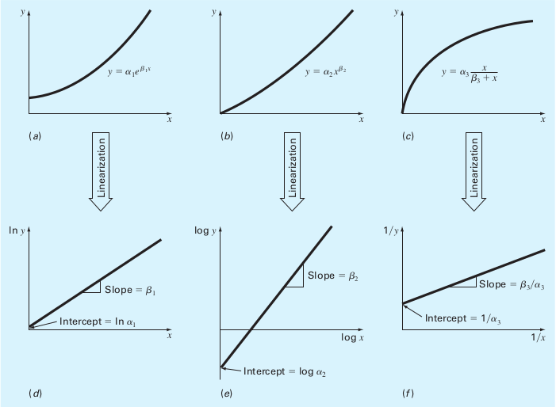
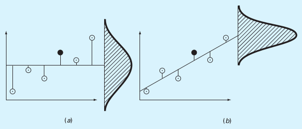

---
jupyter:
  jupytext:
    formats: ipynb,md
    text_representation:
      extension: .md
      format_name: markdown
      format_version: '1.3'
      jupytext_version: 1.11.5
  kernelspec:
    display_name: Python 3 (ipykernel)
    language: python
    name: python3
---

# Regression
**FIZ228 - Numerical Analysis**  
Dr. Emre S. Tasci, Hacettepe University


**Case Data (Chapra, 14.6):**

|$i$|$x_i$|$y_i$|
|---|---|---|
|1|10|25|
|2|20|70|
|3|30|380|
|4|40|550|
|5|50|610|
|6|60|1220|
|7|70|830|
|8|80|1450|

Let's try to fit it to a linear model, $y = ax+b$. Doesn't matter whether we're using least squares method or minimizer, they will both yield the best answer.

```python
import numpy as np

import seaborn as sns
sns.set_theme()

data = np.array([range(10,90,10),[25,70,380,550,610,1220,830,1450]]).T
x = data[:,0]
y = data[:,1]
print(data)
```

As our function values ($ax + b$) will be calculated as: 

```
a(10) + b = 25
a(20) + b = 70
...
a(80) + b = 1450
```

We also need to include b's coefficients (our polynomial function actually being $a_1 x^1 + a_0 x^0$) in the data as well. We do this by _stacking_ a column of ones for b's coefficients:

```python
A = np.vstack([x,np.ones(len(x))]).T
A
```

```python
a,b = np.linalg.lstsq(A,y,rcond=None)[0]
print("a: {:.5f}\tb: {:.5f}".format(a,b))
```

While we are at it, let's plot it:

```python
import matplotlib.pyplot as plt

xx = np.linspace(0,80,100)
yy = a*xx + b
plt.plot(xx,yy,"b-",x,y,"ko",markerfacecolor="k")
plt.show()
```

And here's the error (sum of the squares of the estimate residuals ($S_r$)):

$$S_r = \sum_{i}{e_i^2}=\sum_{i}\left(y_i-a_0-a_1 x_i\right)^2$$

```python
t = a*x + b
e = y-t
S_r = np.sum(e**2)
print(S_r)
```

and here's how to do the same thing (albeit, systematically ;) using functions:

```python
def fun_lin(alpha, beta, x):
    return alpha*x + beta

def err_lin(params):
    e = y - fun_lin(params[0],params[1],x)
    return np.sum(e**2)
err_ls = err_lin([a,b])
print("Least-square sum of squares error: {:10.2f}".format(err_ls))
```

# Linearization of Non-linear Relationships

It doesn't much matter even if the model we're trying to fit is non-linear. We can simply apply a transformation to form it into a linear one. Here are a couple example for handling non-linear functions:

|Model|Nonlinear|Linearized|
|---|-----------|----------|
|exponential|$y=\alpha_1 e^{\beta_1 x}$|$\ln{y}=\ln{\alpha_1}+\beta_1 x$|
|power|$y = \alpha_2 x^{\beta_2}$|$\log{y}=\log{\alpha_2}+\beta_2\log{x}$|
|saturation-growth-rate|$y=\alpha_3\frac{x}{\beta_3+x}$|$\frac{1}{y}=\frac{1}{\alpha_3}+\frac{\beta_3}{\alpha_3}\frac{1}{x}$



(Source: [S.C. Chapra, Applied Numerical Methods with MATLAB](https://www.mheducation.com/highered/product/applied-numerical-methods-matlab-engineers-scientists-chapra/M9780073397962.html))


## Same yet different
Instead of fitting the given data into a linear model, let's fit them to a power model:

**Example: Fit the data to the power model (Chapra, 14.6)**  
Data:  

|$i$|$x_i$|$y_i$|
|---|---|---|
|1|10|25|
|2|20|70|
|3|30|380|
|4|40|550|
|5|50|610|
|6|60|1220|
|7|70|830|
|8|80|1450|

Find the optimum $\alpha$ and $\beta$ for the best fit of $y=\alpha x^\beta$ for the given data.

```python
import pandas as pd
import numpy as np
import matplotlib.pyplot as plt
data1 = pd.DataFrame({'i':np.arange(1,9),'x':np.arange(10,90,10),
                      'y':[25,70,380,550,610,1220,830,1450]})
data1.set_index('i', inplace=True)

data1
```

```python
plt.plot(data1.x,data1.y,"o")
plt.show()
```

<!-- #region -->
## Least-squares proper way:
We can convert it such that $$\log{y}=\log{\alpha} + \beta\log{x}$$ 

and as the least square fit for a linear model given as $y' = a_0 + a_1 x'$ is:

$$a_1 = \frac{n\sum{x_i' y_i'} - \sum{x_i'}\sum{y_i'}}{n\sum{x_i'^2}-\left(\sum{x_i'}\right)^2}$$

$$a_0 = \bar{y}' - a_1\bar{x}'$$


(For derivations, refer to [FIZ219 Lecture Notes #5](https://emresururi.github.io/FIZ219/FIZ219_EST_UygulamaNotlari_05_En_kucuk_kareler.html))

and since $x_i' = \log{x_i},\;y_i' = \log{y_i}$:

<!-- #endregion -->

```python
n = data1.shape[0]
xp = np.log(data1.x)
yp = np.log(data1.y)

a1 = (n*np.sum(xp*yp)-np.sum(xp)*np.sum(yp)) / (n*np.sum(xp**2) - np.sum(xp)**2)
a0 = np.mean(yp) - a1*np.mean(xp)

print("a0: {:7.4f}\na1: {:7.4f}".format(a0,a1))
```

as $a_0 = \log{\alpha}\rightarrow \alpha = e^{a_0}$ and $a_1 x' = \beta\log{x}\rightarrow  \beta = a_1$

```python
alpha = np.exp(a0)
beta = a1
print("alpha: {:7.4f}\nbeta:  {:7.4f}".format(alpha,beta))
```

```python
def fun(alpha, beta, x):
    return alpha*x**beta
```

```python
xx = np.linspace(0,80,100);
yy = fun(alpha,beta,xx)
plt.plot(data1.x,data1.y,"or",xx,yy,"-b")
plt.show()
```

## Minimizing the error function:

```python
def fun_pow(alpha, beta, x):
    return alpha*x**beta

x = data1.x
y = data1.y
def err(params):
    e = y - fun_pow(params[0],params[1],x)
    return np.sum(e**2)

from scipy.optimize import minimize

res = minimize(err,[0.274,1.98])
print(res)
alpha2,beta2 = res.x
```

```python
xx = np.linspace(0,80,100);
yy2 = fun(alpha2,beta2,xx)
plt.plot(data1.x,data1.y,"or",xx,yy2,"-k")
plt.show()
```

### Which one is better?

```python
err_ls = err([alpha,beta])
err_min = err([alpha2,beta2])
print("Least-square sum of squares error: {:10.2f}".format(err_ls))
print("   Minimizer sum of squares error: {:10.2f}".format(err_min))
```

Let's plot the two side by side:

```python
xx = np.linspace(0,80,100);
yy_ls = fun(alpha,beta,xx)
yy_min = fun(alpha2,beta2,xx)
# Blue for least-squares, Black for minimizer
plt.plot(data1.x,data1.y,"or",xx,yy_ls,"-b",xx,yy_min,"-k")
plt.legend(["data","least-squares","minimizer"])
plt.show()
```

# Really, which one is better?
Apart from the power fits, we performed an even simpler operation, namely, fit the data to a linear model. Let's put all the three together:

```python
xx = np.linspace(0,80,100);
yy_ls_pow = fun(alpha,beta,xx)
yy_min_pow = fun(alpha2,beta2,xx)
yy_ls_lin = fun_lin(a,b,xx)

# Blue for least-squares, Black for minimizer
plt.plot(data1.x,data1.y,"or",xx,yy_ls_pow,"-b",\
         xx,yy_min_pow,"-k",\
         xx,yy_ls_lin,"-m")
plt.legend(["data","least-squares (power)",\
            "minimizer (power)","least-squares (linear)"])
plt.show()
```

and here is a table of the errors:

|Method|Error ($S_r$)
---|---
LS (power) | 345713.59
Minimizer (power) | 222604.85
LS (linear) | 216118.15

So, we should take the linear least-squares fit as it yields the closest results... or, is it? (it is indeed, as it has the lowest error).

Now what would you say if I told you, this was some kind of force vs. velocity" data -- would you change your mind then?

Here, let's make the graph in the proper way:

```python
plt.plot(data1.x,data1.y,"or",xx,yy_ls_pow,"-b",\
         xx,yy_min_pow,"-k",\
         xx,yy_ls_lin,"-m")
plt.legend(["data","least-squares (power)",\
            "minimizer (power)","least-squares (linear)"])
plt.title ("(Some kind of) Force vs. Velocity")
plt.xlabel("v (m/s)")
plt.ylabel("F (N)")
plt.show()
```

Even though the linear model produces better fit, the bothersome thing is its behaviour for small velocities: the fit carries the response to negative forces which doesn't make much sense (can you think of a case that behaves like this? Downwards for low velocities alas upwards for high velocities? Non-newtonian liquids? Not very likely).

Therefore, even if it's not the best fit, realizing that we are actually dealing with forces and velocity, not some mathematical toy but physical quantities, it -hopefully- makes much more sense to choose the power model over the linear model.

So our equation looks something like this:

$$F = \alpha v^\beta$$

with $(\alpha,\beta)$ being equal to:

method|$\alpha$|$\beta$
----|------|----
LS|0.2741|1.9842
Minimizer|2.5384|1.4358

Still, are we insisting on taking the minimizer's results (because it yielded a better fit)?

In physics, the power relations are usually (and interestingly, actually) integers. LS's $\beta$ of 1.9842 looks suspiciously close to a clean 2 whereas the minimizer's 1.4358 looks as if... nothing.

So, to cut a long story short, that "some kind of force" was actually the _Drag Force_ $\vec{D}$, defined as:

$$\vec{D} = \frac{1}{2}C\rho A v^2$$

with $C$ being the drag coefficient (empirically determined); $\rho$ the density of the medium and $A$ being the effective cross-section of the body.

**Moral of the story: We are not mathematicians, nor computers but we are humans and physicists! Always eye-ball the model and more importantly use your heads! 8)**

<!-- #region -->
# Over regression
If you have $n$ datapoints, you can _perfectly_ fit a polynomial of (n-1)th order:

Once again, let's check our good old data:


|$i$|$x_i$|$y_i$|
|---|---|---|
|1|10|25|
|2|20|70|
|3|30|380|
|4|40|550|
|5|50|610|
|6|60|1220|
|7|70|830|
|8|80|1450|
<!-- #endregion -->

```python
data = np.array([range(10,90,10),[25,70,380,550,610,1220,830,1450]]).T
x = data[:,0]
y = data[:,1]
```

```python
def err_Sr(y,t):
     # Sum of the squares of the estimate residuals
    return np.sum((y-t)**2)
```

## Order : 7

```python
p = np.polyfit(x,y,len(x)-1)
print(p)
```

```python
xx = np.linspace(10,80,100)
yy = np.zeros(len(xx))
n = len(x)
for k in range(n):
    yy += p[k]*xx**(n-k-1)

# we could as well had used poly1d function
# to functionalize the polynomial 8)
f = np.poly1d(p)
print(f(x))

print("Sum of squares error: {:10.2f}".format(err_Sr(y,f(x))))

plt.plot(xx,yy,"-b",x,y,"ok",xx,f(xx),"-r")
plt.show()
```

## Order : 6 ... 2

```python
for s in np.arange(2,8):
    print("Order: {:d}".format(len(x)-s))
    p = np.polyfit(x,y,len(x)-s)
    print(p)

    xx = np.linspace(10,80,100)
    yy = np.zeros(len(xx))

    f = np.poly1d(p)
    print("Sum of squares error: {:10.2f}".format(err_Sr(y,f(x))))

    plt.plot(xx,yy,"-b",x,y,"ok",xx,f(xx),"-r")
    plt.show()
```

# How good are we?

## Coefficient of determination ($r^2$)
We have already met with $r^2$ in our [lecture on least squares](FIZ228_03_LeastSquaresErrors.html): it is concerned with the variations from the average value and residuals' distance.

The data points' distances from the average value leads to the sum of the squares of the data residuals ($S_t$), and defined as:

$$S_t = \sum_{i}{\left(y_i - \bar{y}\right)^2}$$

whereas, the sum of the squares of the estimate residuals ($S_r$) is calculated on the difference between the model estimation and the data:

$$S_r = \sum_{i}{e_i^2}=\sum_{i}\left(y_i-t_i\right)^2$$

And here are them, visualized for a linear fit:


(a) $S_t$, (b) $S_r$

(Source: [S.C. Chapra, Applied Numerical Methods with MATLAB](https://www.mheducation.com/highered/product/applied-numerical-methods-matlab-engineers-scientists-chapra/M9780073397962.html))

Using these two quantities, the coefficient of determination ($r^2$) is calculated as:

$$r^2 = \frac{S_t-S_r}{S_t}$$

Where a result of 1 (hence, $S_r = 0$) indicating a perfect fit, $r^2=0$ meaning we could have actually picked the average value and a negative $r^2$ indicating that even picking the average value would be better than this fit!


# References & Acknowledgements
* This lecture is heavily benefited from Steven Chapra's [Applied Numerical Methods with MATLAB: for Engineers & Scientists](https://www.mheducation.com/highered/product/applied-numerical-methods-matlab-engineers-scientists-chapra/M9780073397962.html).
