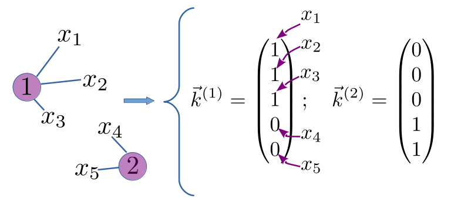
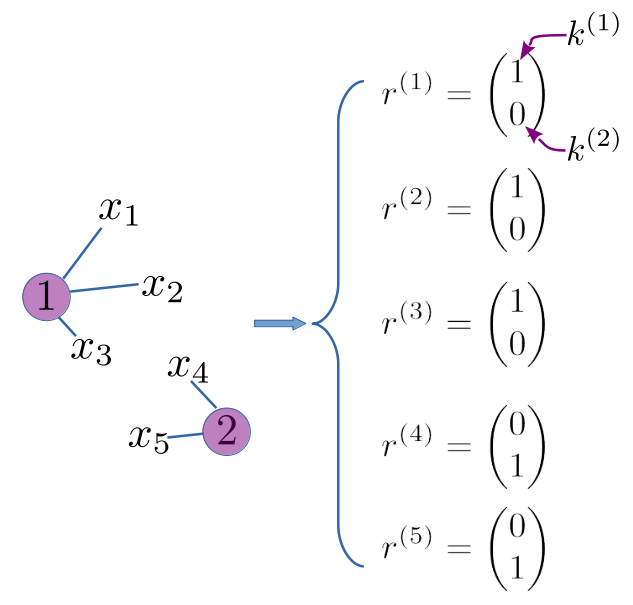

---
jupytext:
  formats: ipynb,md:myst
  text_representation:
    extension: .md
    format_name: myst
    format_version: 0.13
    jupytext_version: 1.11.5
kernelspec:
  display_name: Python 3 (ipykernel)
  language: python
  name: python3
---

# Clustering and Classification
**FIZ228 - Numerical Analysis**  
Dr. Emre S. Tasci, Hacettepe University

+++

```{note}
_This lecture is heavily benefitted (almost copied fully) from David MacKay's "Information Theory, Inference, and Learning Algorithms"](http://www.inference.org.uk/mackay/itila/book.html)._
```

# Introduction

Suppose that we are given the following list, and asked to single out the odd one:

* Frog
* Parsley
* Brocoli
* Spinach
* Cauliflower

Depending on our background, we will be picking one of these two:

*Frog*, because the rest are vegetables, or,  
*Cauliflower*, because the rest are green.

We spend our lives by clustering and classification, because otherwise we wouldn't be able to process the world happening around ourselves.

+++

# Advantages of Clustering
## Predictive Power!
A biologist encounters a new green thing he has not seen before. Even though this is the first time he has seen it, based on his experience, he can assume/deduce that:
* it is unlikely to jump on him and eat him
* if he touches it, he might get grazed/stung
* if he eats it, he might feel sick
These deductions are a case of "mixture density modelling". How well the model is working is the information content of the data $\left(h(x)=\log{\frac{1}{P(x)}}\right)$.

+++

## Lossy Compression!
"Go to third tree on the right, then take a right turn."

Third tree? *Large green thing with red berries, then past the large green thing with thorns, then...*

* lossy: e.g., image compression (jpg); sound compression (mp3) | (vector quantization)
* lossless: image (png, raw); sound (flac)

### Vector Quantizer 
$$\vec{x}\rightarrow k(\vec{x})$$
Assigning datapoints $\vec{x}$ to one of $K$ codenames and a reconstruction rule $k \rightarrow \vec{m}^{(k)}$ to choose the functions $k(\vec{x})$ and $\vec{m}^{(k)}$ so as to minimize the expected distortion:

$$D=\sum_{\vec{x}}{P(\vec{x})\,\frac{1}{2}\left[\vec{m}^{(k(\vec{x}))}-\vec{x}\right]^2 }$$

+++

## Highlighting Anomalies!
If there is an anomaly --> it's a good thing!

**Examples:** 
* The incompressible patches on ocean from a satellite image --> ships/islands
* The sudden peak at the input signals --> some kind of communication signal
* if the green thing runs away --> misfit with the model (something new, something interesting)!

+++

# k-means Clustering
Putting $N$ data points in an $I$-dimensional space into $k$-clusters. Each cluster is parameterized by a vector $\vec{m}^{(k)}$, called its *mean*.

Data points: $\left\{\vec{x}^{(n)}\right\},\quad n=1,\dots,N$

Each vector $\vec{x}$ has $I$ components: $x_i$.

The metric that defines distances between points:

$$d(\vec{x},\vec{y}) = \frac{1}{2}\sum_{i}{\left(x_i - y_i\right)^2}$$

(this metric assumes that every component has the same importance)

+++

## The algorithm (Verbal)
0. **Initializement Step:** Set $k$ means $\left\{\vec{m}^{(k)}\right\}$ to random values.

Two-step algorithm:
1. **Assignment step:** Each data point $n$ is assigned to the nearest mean.
2. **Update step:** Means are adjusted to match the sample means of the data points that they are responsible for.

=> The k-means algorithm always converges to a fixed point!

+++

## The algorithm (Formular)
0. **Initializement Step:** Set $k$ means $\left\{\vec{m}^{(k)}\right\}$ to random values.

Two-step algorithm:
1. **Assignment step:** Each data point $n$ is assigned to the nearest mean. We denote our guess for the cluster $k^{(n)}$ that the point $x^{(n)}$ belongs to by $\hat{k}^{(n)}$:

$$\hat{k}^{(n)}=\text{argmin}_k \left\{{d\left(\vec{m}^{(k)},x^{(n)}\right)}\right\}$$


*alternative approach:* responsibilities as indicator variables $r_k^{(n)}$ 

$$r_k^{(n)}=\begin{cases}
  1\;\text{if}\,\hat{k}^{(n)}=k\\    
  0\;\text{if}\,\hat{k}^{(n)}\ne k
\end{cases} $$

(if there is a tie, set to the smallest winning $\{k\}$).


2. **Update step:** Means are adjusted to match the sample means of the data points that they are responsible for. 

$$\vec{m}^{(k)} = \frac{\sum_{n}{r_k^{(n)}\vec{x^{(n)}}}}{R^{(k)}}$$
$R^{(k)}$: Total responsibility of mean $k$: 

$$R^{(k)} = \sum_{n}{r_k^{(n)}}$$

if $R^{(k)} = 0$ (no responsibility), we leave the mean $\vec{m}^{(k)}$ where it is.

3. Repeat the assignment & update steps until the assignments do not change any more.

+++

# Implementation of the k-means clustering algorithm

```{code-cell} ipython3
import numpy as np
import matplotlib.pyplot as plt

np.random.seed(228)
colors = ["b","g","c","m","y","k","b","g","c","m","y","k"]

N = 10 ## Total number of points
K = 3  ## Total number of means

## World Limits
max_x = 10 
max_y = 5

## Randomly generate the points
xy = np.random.rand(N,2)
xy[:,0]*=max_x
xy[:,1]*=max_y

print(xy)
plt.plot(xy[:,0],xy[:,1],"ob")
for i in range(N):
    plt.text(xy[i,0],xy[i,1],str(i),fontsize=12)
plt.xlim([0,max_x])
plt.ylim([0,max_y])
plt.title("{:d} Randomly Distributed Points".format(N))
plt.show()
```

```{code-cell} ipython3
## Step 0: Initialize the means at random points
m = np.random.rand(K,2)
m[:,0] *= max_x
m[:,1] *= max_y

print(m)
plt.xlim([0,max_x])
plt.ylim([0,max_y])
plt.plot(xy[:,0],xy[:,1],"ob")
for i in range(N):
    plt.text(xy[i,0],xy[i,1],str(i),fontsize=12)
plt.plot(m[:,0],m[:,1],"*r")
for k in range(K):
    plt.text(m[k,0],m[k,1],"["+str(k)+"]",color="red",fontsize=12)
plt.title("Here we randomly initialize the {:d} means".format(K))
plt.show()
```

```{code-cell} ipython3
## Step 1: Assign the responsibilities of each point to the nearest mean
r = np.zeros((N,K))

## Calculate the distance of each point to each mean
def distance(i,k):
    ## Calculates the distance of the ith point to the kth mean
    d = np.linalg.norm((xy[i,0]-m[k,0],xy[i,1]-m[k,1]))
    return d

distances = np.empty((N,K))
for i in range(N):
    for k in range(K):
        distances[i,k] = distance(i,k)
    filter = distances[i,:] == min(distances[i,:])
    # print(filter)
    # print(np.arange(K)[filter])
    ## Assign the responsibilities
    r[i,np.arange(K)[filter]] = 1
print(r)

for k in range(K):
    this_k_set_filter = (r[:,k] == 1)
    print (k,this_k_set_filter)
    plt.plot(xy[this_k_set_filter][:,0],xy[this_k_set_filter][:,1],"o"+colors[k])
    plt.plot(m[k,0],m[k,1],"*"+colors[k])
for i in range(N):
    plt.text(xy[i,0],xy[i,1],str(i),fontsize=12)
for k in range(K):
    plt.text(m[k,0],m[k,1],"["+str(k)+"]",color=colors[k],fontsize=12)
plt.xlim([0,max_x])
plt.ylim([0,max_y])
plt.title("Each point is assigned to the closest mean")
plt.show()
  
```

```{code-cell} ipython3
## Step 2: Update the means' locations so that
## they reside in the center of mass of their points

for k in range(K):
    this_k_set_filter = (r[:,k] == 1)
    # print(xy[this_k_set_filter])
    # print(np.sum(this_k_set_filter))
    mean_k = np.sum(xy[this_k_set_filter],axis=0)/np.sum(this_k_set_filter)
    print(mean_k)
    m[k,:] = mean_k
    plt.plot(xy[this_k_set_filter][:,0],xy[this_k_set_filter][:,1],"o"+colors[k])
    plt.plot(m[k,0],m[k,1],"*"+colors[k])
for i in range(N):
    plt.text(xy[i,0],xy[i,1],str(i),fontsize=12)
for k in range(K):
    plt.text(m[k,0],m[k,1],"["+str(k)+"]",color=colors[k],fontsize=12)

plt.xlim([0,max_x])
plt.ylim([0,max_y])
plt.title("The means are moved to the COM of their set of points")
plt.show()
```

```{code-cell} ipython3
## Step 3: Repeat steps 1 & 2 until there is no change

m_prev = np.zeros((K,2))

step = 1
while(not np.array_equal(m_prev,m)):
    m_prev = m.copy()
    ## Step 1: Assign the responsibilities of each point to the nearest mean
    r = np.zeros((N,K))

    distances = np.empty((N,K))
    for i in range(N):
        for k in range(K):
            distances[i,k] = distance(i,k)
        filter = distances[i,:] == min(distances[i,:])

        ## Assign the responsibilities
        r[i,np.arange(K)[filter]] = 1

    ## Step 2: Update the means' locations so that
    ## they reside in the center of mass of their points

    for k in range(K):
        this_k_set_filter = (r[:,k] == 1)
        mean_k = np.sum(xy[this_k_set_filter],axis=0)/np.sum(this_k_set_filter)
        m[k,:] = mean_k
        plt.plot(xy[this_k_set_filter][:,0],xy[this_k_set_filter][:,1],"o"+colors[k])
        plt.plot(m[k,0],m[k,1],"*"+colors[k])
    for i in range(N):
        plt.text(xy[i,0],xy[i,1],str(i),fontsize=12)
    for k in range(K):
        plt.text(m[k,0],m[k,1],"["+str(k)+"]",color=colors[k],fontsize=12)

    plt.xlim([0,max_x])
    plt.ylim([0,max_y])
    plt.title("Step: {:03d}".format(step))
    plt.show()
    step += 1
```

## Merge them all into one code:

```{code-cell} ipython3
import numpy as np
import matplotlib.pyplot as plt

np.random.seed(228)
colors = ["b","g","c","m","y","k","b","g","c","m","y","k"]

N = 10 ## Total number of points
K = 3  ## Total number of means

## World Limits
max_x = 10 
max_y = 5

## Randomly generate the points
xy = np.random.rand(N,2)
xy[:,0]*=max_x
xy[:,1]*=max_y

plt.plot(xy[:,0],xy[:,1],"ob")
for i in range(N):
    plt.text(xy[i,0],xy[i,1],str(i),fontsize=12)
plt.xlim([0,max_x])
plt.ylim([0,max_y])
plt.title("{:d} Randomly Distributed Points".format(N))
plt.show()

## -------------------------------------------------------

## Step 0: Initialize the means at random points
m = np.random.rand(K,2)
m[:,0] *= max_x
m[:,1] *= max_y

plt.xlim([0,max_x])
plt.ylim([0,max_y])
plt.plot(xy[:,0],xy[:,1],"ob")
for i in range(N):
    plt.text(xy[i,0],xy[i,1],str(i),fontsize=12)
plt.plot(m[:,0],m[:,1],"*r")
for k in range(K):
    plt.text(m[k,0],m[k,1],"["+str(k)+"]",color="red",fontsize=12)
plt.title("Here we randomly initialize the {:d} means".format(K))
plt.show()

## -------------------------------------------------------

## Calculate the distance of each point to each mean
def distance(i,k):
    ## Calculates the distance of the ith point to the kth mean
    d = np.linalg.norm((xy[i,0]-m[k,0],xy[i,1]-m[k,1]))
    return d

## -------------------------------------------------------

## Step 3: Repeat steps 1 & 2 until there is no change

m_prev = np.zeros((K,2))

step = 0
while(not np.array_equal(m_prev,m)):
    m_prev = m.copy()
    ## Step 1: Assign the responsibilities of each point to the nearest mean
    r = np.zeros((N,K))

    distances = np.empty((N,K))
    for i in range(N):
        for k in range(K):
            distances[i,k] = distance(i,k)
        filter = distances[i,:] == min(distances[i,:])

        ## Assign the responsibilities
        r[i,np.arange(K)[filter]] = 1

    ## Step 2: Update the means' locations so that
    ## they reside in the center of mass of their points

    for k in range(K):
        this_k_set_filter = (r[:,k] == 1)
        mean_k = np.sum(xy[this_k_set_filter],axis=0)/np.sum(this_k_set_filter)
        m[k,:] = mean_k
        plt.plot(xy[this_k_set_filter][:,0],xy[this_k_set_filter][:,1],"o"+colors[k])
        plt.plot(m[k,0],m[k,1],"*"+colors[k])
    for i in range(N):
        plt.text(xy[i,0],xy[i,1],str(i),fontsize=12)
    for k in range(K):
        plt.text(m[k,0],m[k,1],"["+str(k)+"]",color=colors[k],fontsize=12)

    plt.xlim([0,max_x])
    plt.ylim([0,max_y])
    plt.title("Step: {:03d}".format(step))
    plt.show()
    step += 1

## Let's also connect the points to their assigned means for a nice view:
for k in range(K):
    this_k_set_filter = (r[:,k] == 1)
    mean_k = np.sum(xy[this_k_set_filter],axis=0)/np.sum(this_k_set_filter)
    m[k,:] = mean_k
    for i in range(np.sum(this_k_set_filter)):
        plt.plot(xy[this_k_set_filter][i,0],xy[this_k_set_filter][i,1],"o"+colors[k])
        plt.plot(np.array([xy[this_k_set_filter][i,0],m[k,0]]),np.array([xy[this_k_set_filter][i,1],m[k,1]]),"-"+colors[k])
    plt.plot(m[k,0],m[k,1],"*"+colors[k])
plt.xlim([0,max_x])
plt.ylim([0,max_y])
plt.title("Connected...")
plt.show()
```

# Soft k-means Clustering
To overcome the bad cases, and also to deal with the following issues (also related to bad cases):
1. Assignment step problem/issue: A point is strictly owned only by one mean -- no matter if it is just next to the mean or at the border of the mean's influence.
2. Update step problem/issue: Every point owned by the mean has exactly the same weight in influencing the mean's new position. However, "everyday logic" (*physics(!)*) dictates/suggests that the further the point, the less influence it has.

These two issues are actually different manifestations of the same problem. The *hardness* of the k-means algorithm can be *softened* by allowing <u>partial ownership</u>, hence the **soft k-means clustering**:

1\. Assignment Step: Responsibility vector (the responsibility of cluster $k$ for point $n$) $r_k^{(n)}$ is redefined by: 

$$r_k^{(n)}=\frac{\exp\left(-\beta\,d\left(\vec{m}^{(k)},x^{(n)}\right)\right)}{\sum_{k'}{\exp\left(-\beta\,d\left(\vec{m}^{(k')},x^{(n)}\right)\right)} }$$ 

where $\beta$ is the *softness parameter* $(\beta\rightarrow\infty\Rightarrow\text{Hard k-means algorithm.})$ The sum of the k-responsibilities for the $n^{th}$ point is 1 (due to the normalizing constant, that is the denominator).

2\. Update step: It is identical to the *hard k-means algorithm*: 

$$\vec{m}^{(k)} = \frac{\sum_{n}{r_k^{(n)}\vec{x^{(n)}}}}{R^{(k)}},\quad R^{(k)} = \sum_{n}{r_k^{(n)}}$$

```{code-cell} ipython3
import numpy as np
import matplotlib.pyplot as plt

np.random.seed(228)
colors = ["b","g","c","m","y","k","b","g","c","m","y","k"]

beta = 1.5 ## Softness paraemeter
NN = 500 ## Max step number

N = 10 ## Total number of points
K = 3  ## Total number of means

## World Limits
max_x = 10 
max_y = 5

## Randomly generate the points
xy = np.random.rand(N,2)
xy[:,0]*=max_x
xy[:,1]*=max_y

plt.plot(xy[:,0],xy[:,1],"ob")
for i in range(N):
    plt.text(xy[i,0],xy[i,1],str(i),fontsize=12)
plt.xlim([0,max_x])
plt.ylim([0,max_y])
plt.title("{:d} Randomly Distributed Points".format(N))
plt.show()

## -------------------------------------------------------

## Step 0: Initialize the means at random points
m = np.random.rand(K,2)
m[:,0] *= max_x
m[:,1] *= max_y

plt.xlim([0,max_x])
plt.ylim([0,max_y])
plt.plot(xy[:,0],xy[:,1],"ob")
for i in range(N):
    plt.text(xy[i,0],xy[i,1],str(i),fontsize=12)
plt.plot(m[:,0],m[:,1],"*r")
for k in range(K):
    plt.text(m[k,0],m[k,1],"["+str(k)+"]",color="red",fontsize=12)
plt.title("Here we randomly initialize the {:d} means".format(K))
plt.show()

## -------------------------------------------------------

## Calculate the distance of each point to each mean
def distance(i,k):
    ## Calculates the distance of the ith point to the kth mean
    d = np.linalg.norm((xy[i,0]-m[k,0],xy[i,1]-m[k,1]))
    return d

## -------------------------------------------------------

## Step 3: Repeat steps 1 & 2 until there is no change

m_prev = np.zeros((K,2))

step = 0

while(not(np.all(m-m_prev<1E-5)) and step<(NN+1)):
    m_prev = m.copy()
    ## Step 1: Assign the responsibilities of each point to the nearest mean
    r = np.zeros((N,K))

    distances = np.empty((N,K))
    for i in range(N):
        for k in range(K):
            #distances[i,k] = distance(i,k) ## Hard k-means
            distances[i,k] = np.exp(-beta*distance(i,k))

        ## Assign the responsibilities
        r[i,:] = distances[i,:] / np.sum(distances[i,:])

    ## Step 2: Update the means' locations so that
    ## they reside in the center of mass of their points

    for k in range(K):
        r_k = r[:,k]
        mean_k = np.multiply(r_k.reshape(N,1),xy)
        mean_k = np.sum(mean_k,axis=0)
        mean_k /= np.sum(r_k)
        
        m[k,:] = mean_k
        if(not(step%10)):
            plt.plot(xy[:,0],xy,"o"+colors[0])
            plt.plot(m[k,0],m[k,1],"*"+colors[k])
    if(not(step%10)):
        for i in range(N):
            plt.text(xy[i,0],xy[i,1],str(i),fontsize=12)
        for k in range(K):
            plt.text(m[k,0],m[k,1],"["+str(k)+"]",color=colors[k],fontsize=12)

        plt.xlim([0,max_x])
        plt.ylim([0,max_y])
        plt.title("Step: {:03d}".format(step))
        plt.show()
    step += 1

plt.plot(xy[:,0],xy[:,1],"o"+colors[0])
plt.plot(m[k,0],m[k,1],"*"+colors[0])
for i in range(N):
            plt.text(xy[i,0],xy[i,1],str(i),fontsize=12)
for k in range(K):
            plt.text(m[k,0],m[k,1],"["+str(k)+"]",color=colors[k],fontsize=12)

plt.xlim([0,max_x])
plt.ylim([0,max_y])
plt.title("Step: {:03d} (Final)".format(step))
plt.show()
#print(r)
print("\n\n{:^44}".format("Responsibility Distributions"))
print("{:^10s}|{:^10s}|{:^10s}|{:^10s}|".format("Point #","mean 0","mean 1","mean 2"))
print("-"*44)
for i in range(r.shape[0]):
    print("{:^10d}|{:^10.6f}|{:^10.6f}|{:^10.6f}|".format(i,r[i,0],r[i,1],r[i,2]))
    print("-"*44)
```

# Reference
[David MacKay's "Information Theory, Inference, and Learning Algorithms"](http://www.inference.org.uk/mackay/itila/book.html).

```{code-cell} ipython3

```
