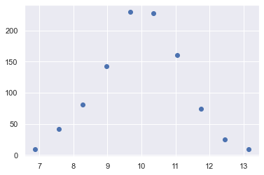
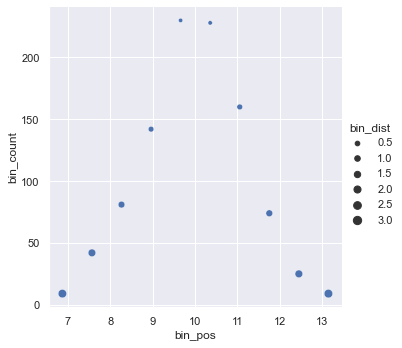
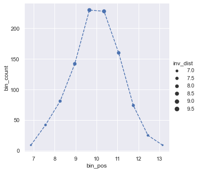

---
jupytext:
  formats: ipynb,md:myst
  text_representation:
    extension: .md
    format_name: myst
    format_version: 0.13
    jupytext_version: 1.11.5
kernelspec:
  display_name: Python 3 (ipykernel)
  language: python
  name: python3
---

# Exercise Set #1 Solutions
**FIZ228 - Numerical Analysis**  
Dr. Emre S. Tasci, Hacettepe University

+++

# 1
Import the meteorological data (`01_meteoblue_Basel_20230303T060433.csv`) as a pandas dataframe (if you can't readily access the course webpage, you can also download it from the [meteoblue site](https://www.meteoblue.com/en/weather/archive/export) with the date range being 1/1/2022 - 3/3/2023 and the parameters set to those you'll need for this example ;).

Then:

* Calculate the average daily temperature on February, 5th, 2022
* Find the most cloudy day in January 2022
* Find the most cloudy hour in January 2022
* Find the most sunny day, calculate the total radiation energy received in 2002

```{code-cell} ipython3
import numpy as np
import pandas as pd
```

## Import and tidy-up the data

```{code-cell} ipython3
data = pd.read_csv("data/01_meteoblue_Basel_20230303T060433.csv",
                   skiprows=9,index_col="timestamp")
data.columns = ["Temperature","Humidity","Cloud Coverage","Sunshine","Radiation"]
data
```

We can drop the rows with "NaN" values either by targeting their index through filtering:

```{code-cell} ipython3
data.drop(data.index[data["Temperature"].isnull()])
```

or, by directly using [pandas.DataFrame.dropna](https://pandas.pydata.org/docs/reference/api/pandas.DataFrame.dropna.html#pandas-dataframe-dropna):

```{code-cell} ipython3
data.dropna(how="all") 
# (how = "all" indicates that all the 
# corresponding columns of the row must be NaN)
```

```{code-cell} ipython3
# Let's actualize the filtering via setting inplace to True
data.dropna(how="all",inplace=True)
data
```

### Calculate the average daily temperature on February, 5th, 2022

```{code-cell} ipython3
filter1 = (data.index>="20220205") & (data.index<"20220206")
data.loc[filter1,"Temperature"]
```

```{code-cell} ipython3
avg_temp = data.loc[filter1,"Temperature"].mean()
print("The average temperature on February, 5th, 2022: {:.2f} °C".format(avg_temp))
```

### Find the most cloudy day in January 2022

```{code-cell} ipython3
filter2 = (data.index>="202201") & (data.index<"202202")
data_cloud_jan = data.loc[filter2,["Cloud Coverage"]]
data_cloud_jan
```

Let's calculate the average cloud coverage per day:

```{code-cell} ipython3
daily_cloud_average = []
for d in range(1,32):
    timestamp_day = "202201{:02d}".format(d)
    timestamp_nextday = "202201{:02d}".format(d+1)
    filter_day = (data_cloud_jan.index>=timestamp_day) \
                    & (data_cloud_jan.index<timestamp_nextday)
    day_clouds = data_cloud_jan.loc[filter_day,"Cloud Coverage"].mean()
    print("Day : {:02d}, Avg. Cloud Coverage: {:.2f}%"\
                .format(d,day_clouds))
    daily_cloud_average.append(day_clouds)
```

The values are stored in the `daily_cloud_average` list, so let's find the location of the max.

```{code-cell} ipython3
max_cloudy_day_index = np.argmax(daily_cloud_average)
print(max_cloudy_day_index)
```

```{code-cell} ipython3
print("The most cloudy day in January 2022 was the {:d}. day"\
      .format(max_cloudy_day_index+1))
print("\twith an average coverage of {:.2f}%"\
      .format(daily_cloud_average[max_cloudy_day_index]))
```

### Find the most cloudy hour in January 2022

This is actually much more easier than the previous part.

```{code-cell} ipython3
filter2 = (data.index>="202201") & (data.index<"202202")
jan2022_cloudy = data.loc[filter2,["Cloud Coverage"]]
jan2022_cloudy
```

```{code-cell} ipython3
jan2022_cloudy["Cloud Coverage"].argmax()
```

```{code-cell} ipython3
jan2022_cloudy.iloc[jan2022_cloudy["Cloud Coverage"].argmax()]
```

### Find the most sunny day, calculate the total radiation energy received in 2002

Let's adapt the code we wrote for the most cloudy day above:

```{code-cell} ipython3
data
```

```{code-cell} ipython3
filter2 = (data.index>="2022") & (data.index<"2023")
data_sun = data.loc[filter2,["Sunshine"]]
data_sun
```

```{code-cell} ipython3
daily_sun_total = {}
for m in range(1,13):
    timestamp_month = "2022{:02d}".format(m)
    timestamp_next_month = "2022{:02d}".format(m+1)
    
    that_month_filter = (data_sun.index>=timestamp_month) \
                        &(data_sun.index<timestamp_next_month)
    last_timestamp_of_that_month = data_sun.index[that_month_filter][-1]
    last_day_of_that_month = last_timestamp_of_that_month[6:8]
    print(last_timestamp_of_that_month," :: ",last_day_of_that_month,"days")
    last_day_of_that_month = int(last_day_of_that_month)
    for d in range(1,last_day_of_that_month+1):
        timestamp_day = "2022{:02d}{:02d}".format(m,d)
        timestamp_nextday = "2022{:02d}{:02d}".format(m,d+1)
        filter_day = (data_sun.index>=timestamp_day) \
                    & (data_sun.index<timestamp_nextday)
        daily_sun_total[timestamp_day] = data_sun.loc[filter_day,"Sunshine"].sum()
        print("Day : {:02d}, Total Sun Duration: {:.2f} minutes"\
                .format(d,daily_sun_total[timestamp_day]))
    print("-"*50)
    
```

The total sun coverage values are stored in the `daily_sun_total` dictionary, so let's find the index of the day with maximum sunshine:

```{code-cell} ipython3
index_of_the_day_with_max_sunshine = np.argmax(list(daily_sun_total.values()))
index_of_the_day_with_max_sunshine
```

And that index corresponds to this day:

```{code-cell} ipython3
most_sunny_day = list(daily_sun_total.keys())[index_of_the_day_with_max_sunshine]
most_sunny_day
```

```{code-cell} ipython3
print("The most sunny day in 2022 was: {:s}".format(most_sunny_day))
print("\twith a total sun coverage of {:.2f} minutes".format(daily_sun_total[most_sunny_day]))
```

## Alternative approach to filtering using regular expressions

Even though the regular expressions are very helpful, getting used to them takes some time, thus here they are included only for those who are interested. 

Instead of constructing our filters via the lower and upper limits, we could have just sought _the timestamps starting with a given pattern_. So, for example, to get the days of February, 2022, we could have indicated the timestamps that begin with "202202". To do this, we check the index as a string that "contains":

```{code-cell} ipython3
data.loc[data.index.str.contains("^202202")]
```

The caret (^) sign at the beginning indicates the beginning. Regular expressions have many similar special place holders. So, for example, if we were interested in the 13:00 hours of February 2022, we could have written:

```{code-cell} ipython3
data.loc[data.index.str.contains("^202202..T1300$")]
```

Here the dot (.) stands for "any character". Likewise, we could have indicated a range, so for example, let's bring the hours between 13:00 and 16:00 (16:00 included) of the same month:

```{code-cell} ipython3
data.loc[data.index.str.contains("^202202..T1[3-6]00$")]
```

Once you get accustomed to them, regular expressions becomes your #1 pattern matching system. For more information, you can refer to [O'Reilly's An introduction to regular expressions](https://www.oreilly.com/content/an-introduction-to-regular-expressions/)

+++

# 2

Draw 1000 samples from a Gaussian (normal) distribution with $\mu =  10$, $\sigma = 1.2$

* Calculate the mean and standard deviation of the samples.  
* Plot its histogram for 10 bins (you can use either matplotlib.pyplot or seaborn).  
    _Hint: You can have the bin positions defined as the average of the left and right boundary of each bin_
    
* Define a pandas dataframe such that it has three columns:  
    * `bin_pos` : bin position
    * `bin_count` : count of the samples per each bin
    * `bin_dist` : its distance to the mean
* Using seaborn, plot the dataframe data such that the horizontal axis is the bin_pos, the vertical axis is the bin_count and the points' sizes change with respect to bin_dist.
    
    * _Challenge: try to modify the graph such that the points closer to the mean are displayed bigger in size, while the dots are connected by a line_
    

```{code-cell} ipython3
import numpy as np
import pandas as pd
import seaborn as sns
import matplotlib.pyplot as plt
import scipy as sp
```

### Draw 1000 samples from a Gaussian (normal) distribution with $\mu =  10$, $\sigma = 1.2$ 

```{code-cell} ipython3
N = 1000
mu = 10
sigma = 1.2
samples = np.random.normal(mu,sigma,N)
```

### Calculate the mean and standard deviation of the samples.

```{code-cell} ipython3
samples.mean(),samples.std()
```

### Plot its histogram for 10 bins (you can use either matplotlib.pyplot  or seaborn).
_Hint: You can have the bin positions defined as the average of the left and right boundary of each bin_

```{code-cell} ipython3
hist = np.histogram(samples,bins=10)
hist
```

```{code-cell} ipython3
b=(hist[1][0:-1]+hist[1][1:])/2
b
```

```{code-cell} ipython3
plt.plot(b,hist[0],"bo")
bb = np.linspace(b.min(),b.max(),100)
#plt.plot(bb,sp.stats.norm.pdf(bb,loc=mu,scale=sigma)*
#         ((b[1]-b[0])*hist[0][0:-1]).sum(),"r--")
#plt.plot(bb,sp.stats.norm.pdf(bb,loc=mu,scale=sigma)*
#         np.trapz(hist[0],dx=(b[1]-b[0])),"g--")

plt.show()
```

### Define a pandas dataframe such that it has three columns:
    * `bin_pos` : bin position
    * `bin_count` : count of the samples per each bin
    * `bin_dist` : its distance to the mean

```{code-cell} ipython3
mean = samples.mean()
data = pd.DataFrame({"bin_pos":b,
                     "bin_count":hist[0],
                     "bin_dist":np.abs(b-mean)})
data
```

### Using seaborn, plot the dataframe data such that the horizontal axis  is the bin_pos, the vertical axis is the bin_count and the points' sizes change with respect to bin_dist.

```{code-cell} ipython3
fig1 = sns.relplot(data=data, x="bin_pos",
                              y="bin_count",
                              #kind="line",
                              marker="o",
                              size="bin_dist")
```

##  _Challenge: try to modify the graph such that the points closer  to the mean are displayed bigger in size, while the dots are connected  by a line_

```{code-cell} ipython3
data["inv_dist"] = 10-data["bin_dist"]
```

```{code-cell} ipython3
fig1 = sns.relplot(data=data, x="bin_pos",
                              y="bin_count",
                              kind="scatter",
                              marker="o",
                              size="inv_dist",
                              )
plt.plot(data["bin_pos"],data["bin_count"],"b--")
plt.show()
```

```{code-cell} ipython3

```
