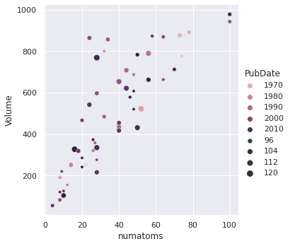

---
jupytext:
  formats: ipynb,md:myst
  text_representation:
    extension: .md
    format_name: myst
    format_version: 0.13
    jupytext_version: 1.11.5
kernelspec:
  display_name: Python 3 (ipykernel)
  language: python
  name: python3
---

# Take-Home Exam #1
**FIZ228 - Numerical Analysis**  
Dr. Emre S. Tasci, Hacettepe University

_It is strictly forbidden to contact anybody outside your group or seeking the direct answer on the internet. Every member of the group is responsible for every one of the questions._

```{code-cell} ipython3
import numpy as np
import pandas as pd
```

```{code-cell} ipython3
import seaborn as sns
sns.set_theme()
```

Monoclinic structures' space groups are designated in the range of $[3,15]$. 

a) From the random structures database (file: `01_RandomStructureDB.csv`), filter the monoclinic structures and copy them to a new `strdb_monoclinic` dataframe, resetting the index (as there are 88 such entries, the index will run from 0 to 87).

b) Calculate their unit cell volumes:  
   lattice parameters are stored in the `a,b,c,alpha,beta,gamma` columns:  
   * $\alpha$ is the angle between b & c,
   * $\beta$ is the angle between a & c,
   * $\gamma$ is the angle between a & b  
   
   add a `Volume` column that stores their corresponding volumes. 
   
   A generic volume formula for all kinds of structures is defined as:
   
   $$V = a b c \sqrt{1+2\cos(\alpha)\cos(\beta)\cos(\gamma)-\cos^2(\alpha)-\cos^2(\beta)-\cos^2(\gamma)}$$
   
   (Keep in mind that the angles are given in degrees, not radians!)
   
   <b>Hint:</b> You can directly evaluate operations with columns, for example: `strdb_monoclinic['a']*strdb_monoclinic['b']` will return you a Pandas object (Series) that holds the summations of the corresponding a and b values! ;)

c) Drop the structures that have volumes greater than $1000\, \unicode[serif]{xC5}^3$ from `strdb_monoclinic` and re-reset the index (you should have 55 entries remaining)

d) Plot the histogram of the volumes (using 10 bins). 

It should like this:


**Bonus:** ["Pearson symbol"](https://en.wikipedia.org/wiki/Pearson_symbol) contains the lattice type, centering and the number of atoms in the unit cell. For example, the Pearson symbol "mP64" indicates that the lattice is **m**onoclinic, **P**rimitive and contains 64 atoms in the unit cell. We are going to parse the number of atoms information from the Pearson cell (by discarding all the characters that are not numeric -- this is easily done using [regular expressions](https://en.wikipedia.org/wiki/Regular_expression): they look cryptic but can be used to describe any pattern if used correctly). To do this operation, we will employ Pandas' `replace()` method:

```python
strdb_monoclinic.loc[:,['PearsonSymb']].replace(r"[^0-9]","",regex=True)
```

**Explanation:**
1. `strdb_monoclinic.loc[:,['PearsonSymb']]` :retrieve the PearsonSymb column
2. `.replace(r"[^0-9]","",regex=True)`: for each value, find all the characters that are not numeric (i.e., not a digit from 0 to 9 -- '^' indicates negation), replace it with nothing (i.e., "") and interpret our query as a regex operation (i.e., `regex=True`)

Here is a sample:

(As in this tutorial we are constructing our dataframe from a string, not a file, we make it appear as a file via the `StringIO` command)

```{code-cell} ipython3
from io import StringIO
sample_data = StringIO('StructuralForm,PearsonSymb\nCe Ru2 Ge2,tI10\nLa1.85 Si4 Y3.15,tP36\nGd Mn2,cF24\nCe5 Ni1.85 Si3,hP39\nLi3 Mg2 (Nb O6),oF96\n')
sample_df = pd.read_csv(sample_data)
sample_df
```

```{code-cell} ipython3
# find and replace the non-numeric characters in 'PearsonSymb'
sample_df.loc[:,['PearsonSymb']].replace(r"[^0-9]","",regex=True)
```

```{code-cell} ipython3
# while we are at it, we can define a new column
# using these processed values as well! 8)

# Pay special attention that we need to convert the replace results
# to integers (using 'astype(int)')
sample_df['numatoms'] = sample_df.loc[:,['PearsonSymb']]\
        .replace(r"[^0-9]","",regex=True).astype(int)
sample_df
```

Now that we have learned how to parse the number of atoms in the unit cell, use this to plot volume with respect to the number of atoms, and while doing that, use the publication date as hue and the beta angle(*) as size via Seaborn.

_**(\*) Challenge:** In standard settings, for monoclinic structures, beta angle is defined as the non-perpendicular angle. However, as you can observe, sometimes the data is entered in non-standard settings and alpha or gamma can be defined as the non-perpendicular angle as well. To remedy this issue, instead of using beta angle, use the maximum angle among the (alpha,beta,gamma) for your size criteria, if you can! ;)_

It should look like this:



```{code-cell} ipython3

```
